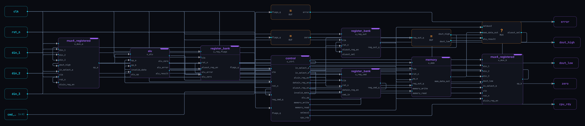

# CI Expert - Grupo1

Repositório para desenvolvimento do projeto final CI-Expert do Grupo 1

Integrantes: 
| Nome | Especialização |
| -- | -- |
| Luigi Ciambarella Filho     | Design for Test |
| Danilo Machado de Oliveira  | Design for Test |
| Andre Araujo                | Design Verification |
| Lenisa Maria Costa de Souza | Design Verification |
| Mateus Soares dos Santos    | Design Verification |
| Daniel de Almeida Arantes   | Physical Design |
| Gabriel Fazion dos Santos   | Physical Design |
| Ludmila Moreira da Silveira | RTL Synthesis |
| Emmanuel Priestley Titus    | RTL Synthesis |

# Projeto

O objetivo do projeto é implementar um processador multi-ciclo, com a arquitetura definida abaixo como referência, não necessariamente a arquitetura final.

# Repositório

Este repositório tem como objetivo centralizar o desenvolvimento e facilitar a comunicação entre os integrantes. 

Todos tendo acesso ao trabalho dos outros e facilitando o fluxo de design.

## Arquivos de suporte

Os arquivos de suporte foram criados para facilitar o trabalho e a discussões entre os integrantes, sempre é interessante outros olhares e algo diferente a ser comparado para achar mais inconsistências.

Extremamente útil para servir de ponte entre quem for desenvolver o RTL e quem for Verificar.

Foram criados:
- constraints.sdc: arquivo inicial de rascunho com os requisitos do roteiro
- Stubs: Já foi gerado alguns verilog stubs, com base no documento de roteiro do projeto. Eles tem como objetivo faciliar a vizualização da arquitetura para guiar as decisões, eles não refletem necessariamente o design final 
- simulador: Em desenvolvimento um simulador em C, para ser usado como referência cruzada com golden model utilizado no UVM e na verificação do design.
- assembler: Futuro desenvolvimento planjeado de um assembler para facilitar a criação de testes.